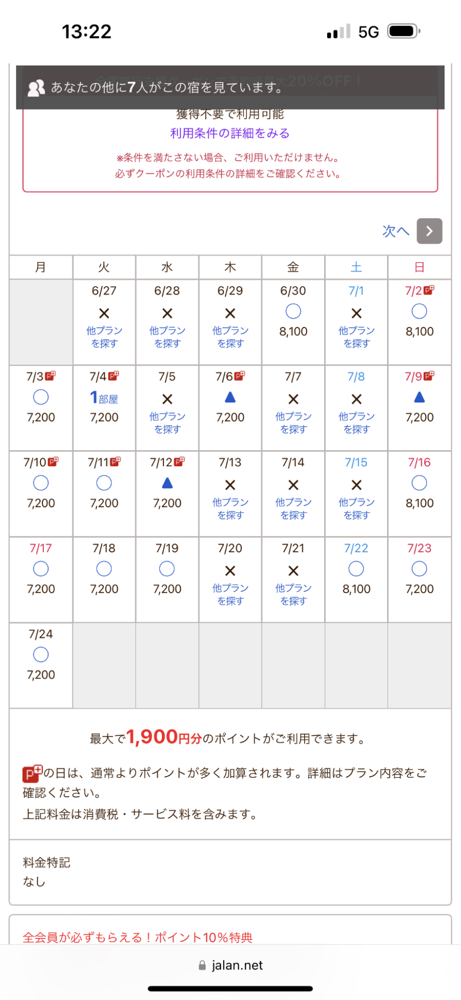

<html>
<head>
  <meta content="text/html; charset=UTF-8" http-equiv="content-type">
  
</head>
<body class="c6 doc-content"><h1 class="c7" id="h.enasalssl92r">Homepage</h1>

  

<ul class="c1 lst-kix_x5k5kxyz4q02-0 start">
  <li class="c8 c10 li-bullet-0">Net reservations</li>
</ul>
<ul class="c1 lst-kix_x5k5kxyz4q02-1 start">
  <li class="c4 li-bullet-0">via form</li>
</ul>
<ul class="c1 lst-kix_x5k5kxyz4q02-2 start">
  <li class="c8 c9 li-bullet-0">Need system for employees to be informed of new reservations, CRUD for reservations, etc.
  </li>
  <li class="c8 c9 li-bullet-0">flow</li>
</ul>
<ul class="c1 lst-kix_x5k5kxyz4q02-3 start">
  <li class="c5 li-bullet-0">Calendar -&gt;</li>
  <li class="c5 li-bullet-0">Preview -&gt;</li>
  <li class="c5 li-bullet-0">Reserve</li>
</ul>
<ul class="c1 lst-kix_x5k5kxyz4q02-1">
  <li class="c4 li-bullet-0">via phone</li>
</ul>
<ul class="c1 lst-kix_x5k5kxyz4q02-2 start">
  <li class="c8 c9 li-bullet-0">backend CRUD system for Win Village employees to input data</li>
  <li class="c8 c9 li-bullet-0">knowledge base system for answering questions</li>
</ul>

<h1 class="c7" id="h.13a1cgsni4bn">Customer management system</h1>

<ul class="c1 lst-kix_k0o3zz1jfml5-0 start">
  <li class="c8 c10 li-bullet-0">CRUD operations</li>
  <li class="c8 c10 li-bullet-0">mailing list</li>
  <li class="c8 c10 li-bullet-0">ticket system for managing problems?</li>
</ul>
<ul class="c1 lst-kix_k0o3zz1jfml5-1 start">
  <li class="c4 li-bullet-0">Search customers</li>
  <li class="c4 li-bullet-0">Customer details </li>
  <li class="c4 li-bullet-0">has_paid</li>
  <li class="c4 li-bullet-0">payment_successful</li>
</ul>
<ul class="c1 lst-kix_k0o3zz1jfml5-0">
  <li class="c8 c10 li-bullet-0">Customer Card (?)</li>
  <li class="c3 c10 li-bullet-0"></li>
</ul>

<h1 class="c7" id="h.d6idka3vn08k">Inventory management</h1>
<ul class="c1 lst-kix_cy0xsdmmoc2g-0 start">
  <li class="c8 c10 li-bullet-0">Grocery inventory</li>
  <li class="c8 c10 li-bullet-0">Room inventory?</li>
</ul>

<h1 class="c7" id="h.bewob2bi46s4">Sales/Payment management</h1>
<h1 class="c7" id="h.9o5ynfw9mpev">Purchase Order management</h1>

<h1 class="c7" id="h.jptox44zlr0l">Room/Reservation management</h1>
<ul class="c1 lst-kix_jj5uagjzgayr-0 start">
  <li class="c8 c10 li-bullet-0">Price Change during set times or days (holidays, etc.)</li>
  <li class="c8 c10 li-bullet-0">Reserved rooms (reserved via site or phone)</li>
  <li class="c8 c10 li-bullet-0">Non-reserve rooms x 8 (reserved at counter, hourly/short stay)
  </li>
</ul>

<h1 class="c7" id="h.lgiolno51vkx">BBQ sets</h1>
<ul class="c1 lst-kix_dsorvgjz2agj-0 start">
  <li class="c8 c10 li-bullet-0">Purchase along with reserve</li>
  <li class="c8 c10 li-bullet-0">Can take home (not rental)</li>
</ul>

<h1 class="c7" id="h.lkzu9odxz7s4">Grocery </h1>
<ul class="c1 lst-kix_3riarzsq2kyg-0 start">
  <li class="c8 c10 li-bullet-0">Purchase food to BBQ</li>
</ul>
<h1 class="c7 c11" id="h.6lcjlofg7r5u"></h1>

CSV\

</body>
</html>